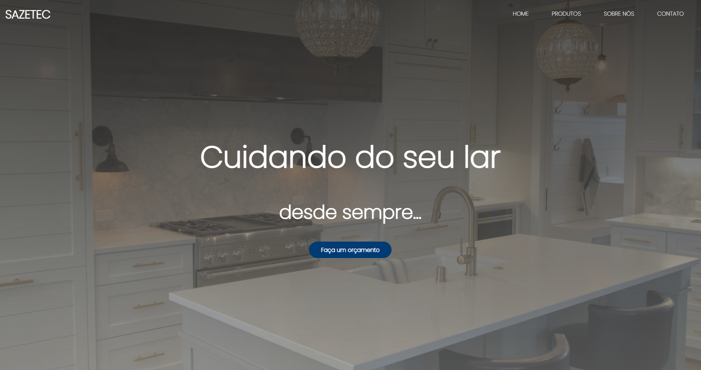
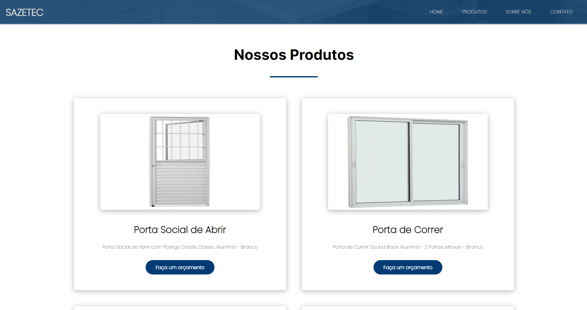

# SAZETEC

E Commerce voltado a venda de portas e janelas

## Funcionalidades

- Contato com vendedores
- Preview em tempo real
- Multiplataforma

## Screenshots

 

## Documentação de cores

| Cor               | Hexadecimal                                                |
| ----------------- | ---------------------------------------------------------------- |
| Cor primária       |  #FFF |
| Cor secundária       |  #000 |
| Cor terciária       |  #003B73 |
| Cor quaternária       |  #0D0933 |

## Stack utilizada

**Front-end:** HTML5, CSS, JAVASCRIPT

## Deploy

Para fazer o deploy desse projeto acesse

  https://stunning-bombolone-e7f74c.netlify.app

## Licença

[MIT](https://choosealicense.com/licenses/mit/)

